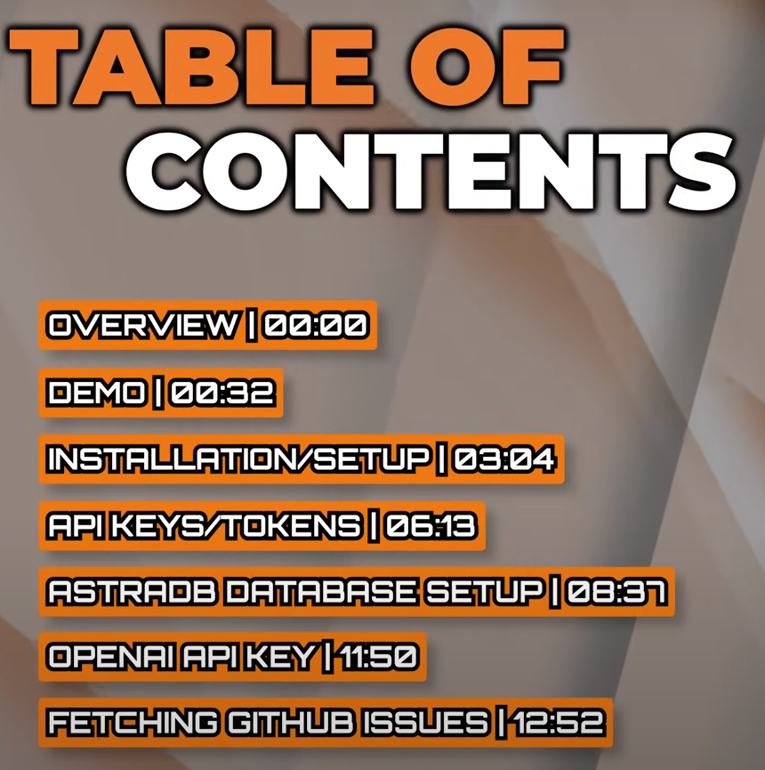
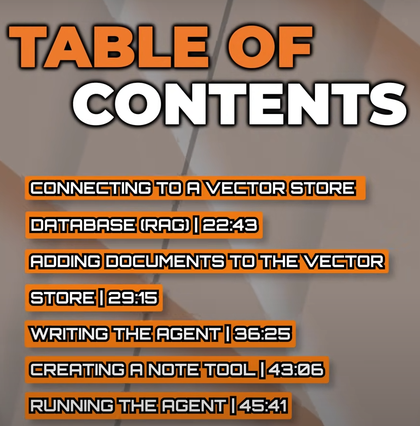

# CustomAIAgent_RAG_LangChain

- build your own custom AI agent with Python using Retrieval Augmented Generation (RAG) and LangChain.
- Learning from TechWithTim Youtube channel

# what we do here?

- Query information about one of github repositories - `https://github.com/techwithtim/Flask-Web-App-Tutorial/issues`
- make an AI Agent that acts like a coding or github assistant
  
  

# Installation/Setup

- Create a virtual environment to install the various packages that we need - `python -m venv github` - github is name of our virtual environment
- activate the virtual environment - `source github/scripts/activate` - windows cmd - for mac it is - `source github/bin/activate` & we see github prefix in our terminal as follows

```
(github)
abhis@Tinku MINGW64 ~/Desktop/AIAgents/CustomAIAgent_RAG_LangChain (main)
$
```

- let's install different packages:

  - `python-dotenv` for loading in environment variables
  - `requests` module to send requests to github API to get different issues
  - `langchain` package - to write our agent
  - `langchain-astradb` - use this as vector store db provider comes from datastax
  - `google_generativeai`
  - `langchainhub`
  - command - `pip install python-dotenv requests langchain langchain-astradb google_generativeai langchainhub`

- let's get different tokens and credentials that we need for this project into `.env` - in this file we store all of the sensitive credentials that we're going to need as we connect to various apis , databases & Gemini Model 1.0 pro
- create a new token in our github profile - https://github.com/settings/tokens
- go to https://astra.datastax.com/ after creating your profile
- We're going to be building a RAG application - Retrieval Augmented Generation
  - Means our AI Agent is going to have access to in this case a database called vector store database & where it can really quickly look up in query information
  - now datastax will be providing that database through their product knows as astra-db - which is a very fast vector db that allows us to really lookup information based on similarity
  - Now AI Agent will utilize this vector database , it's going to query for a certain piece of information & then it can look up based on similarity & then return that data w.r.t query to our model so it can utilize it and give us some results based on it
- The above is basic setup of RAG
  - Usually we are using a vector store database and the way this works is we have vectorized information that allows us to search for information based on
    - context
    - similarity
  - that's much faster and more effiecient than using a traditional sql database
- we need to get all these .env variables :

```
GITHUB_TOKEN=""
ASTRA_DB_API_ENDPOINT=""
ASTRA_DB_APPLICATION_TOKEN=""
<!-- ASTRA_DB_KEYSPACE="" -->
GOOGLE_API_KEY=""
```
